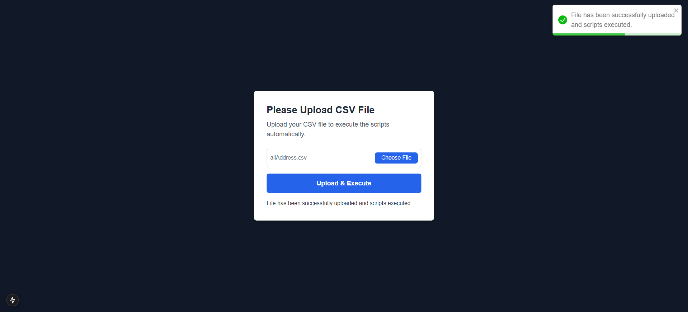

This is a [Next.js](https://nextjs.org) project bootstrapped with [`create-next-app`](https://nextjs.org/docs/app/api-reference/cli/create-next-app).

## Getting Started

First, run the development server:

```bash
npm run dev
# or
yarn dev
# or
pnpm dev
# or
bun dev
```
enter .csv file for process.
and add .env.locl file for run it locally.

Open [http://localhost:3000](http://localhost:3000) with your browser to see the result.

You can start editing the page by modifying `app/page.tsx`. The page auto-updates as you edit the file.

This project uses [`next/font`](https://nextjs.org/docs/app/building-your-application/optimizing/fonts) to automatically optimize and load [Geist](https://vercel.com/font), a new font family for Vercel.

## Learn More

To learn more about Next.js, take a look at the following resources:

- [Next.js Documentation](https://nextjs.org/docs) - learn about Next.js features and API.
- [Learn Next.js](https://nextjs.org/learn) - an interactive Next.js tutorial.

You can check out [the Next.js GitHub repository](https://github.com/vercel/next.js) - your feedback and contributions are welcome!

## Deploy on Vercel

The easiest way to deploy your Next.js app is to use the [Vercel Platform](https://vercel.com/new?utm_medium=default-template&filter=next.js&utm_source=create-next-app&utm_campaign=create-next-app-readme) from the creators of Next.js.

Check out our [Next.js deployment documentation](https://nextjs.org/docs/app/building-your-application/deploying) for more details.

--------------------------------------------------------------------------------------------------------------------------------------------------------------------------------------------------------------------------------------------------------------------------------------------------------------------

Script Instructions
This guide explains how to use the scripts to process a .csv file and submit the data. Follow the steps below for a smooth workflow.

Prerequisites:
1) Prepare the CSV File 
2) Ensure your .csv file is formatted correctly. See CSV Format for details.
Run the Script

Open the application.
Click on the "Choose File" button to select your .csv file.
Only .csv files are supported. If you upload another format, it will be rejected.
Submit the File

Once the .csv file is selected, click the Submit button.
This will trigger the script to process your file and execute the necessary operations.
Check the Results

If successful, the application will display a success message with relevant details.
In case of errors, review the logs displayed in the terminal or console for troubleshooting.
CSV Format


The .csv file must follow this format: address and userEmail is mandatory now
address,userEmail
123 Example St, NY, USA,john.doe@example.com
456 Another Rd, LA, USA,jane.doe@example.com


Example File:
csv 
address,userEmail
123 Example St, NY, USA,jane.doe@example.com
456 Another Rd, LA, USA,jane.doe@example.com
789 Sample Ave, SF, USA,jane.doe@example.com
Note: The address column is mandatory, and each row must contain a valid address. Ensure the file is saved in .csv format.

Expected Outputs
Success:
A message confirming successful processing will be displayed. and one message will wrtten their like file has been uploaded successfully.

Error:
If any issues occur (e.g., invalid file format, missing data), the system will display error logs for troubleshooting.

images of working model:

)
)


